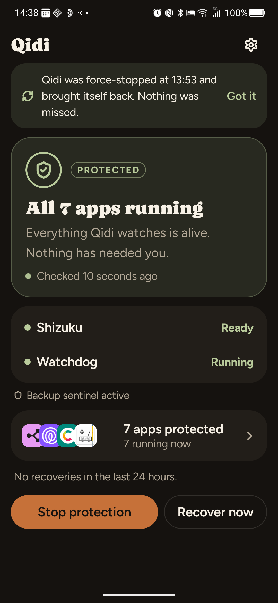
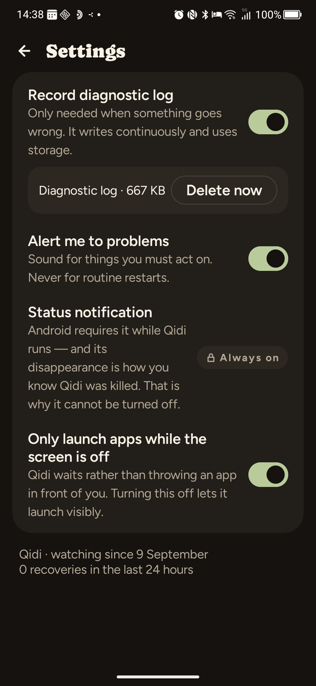

# Qidi

Qidi keeps chosen Android apps alive on devices whose manufacturer aggressively force-stops
background apps. It runs privileged shell commands through [Shizuku](https://shizuku.rikka.app/)
— no root — detects when a protected app has been killed, and restarts it without taking over
your screen.

It was built for a TCL device whose "Smart Manager" force-stops protected apps in batches,
including Qidi itself. Over one five-week stretch Qidi was killed and recovered automatically
**181 times**.

<p align="center">
  
  
</p>

## How it works

**Protections.** For every selected app Qidi reapplies the Doze whitelist, an `active` standby
bucket, and the background AppOps that OEM cleanup tends to strip.

**Watchdog.** A foreground service polls the state of each protected app and restarts anything
that has been stopped.

**Quiet restarts.** Apps are brought back without stealing focus: clear the stopped flag, start
a declared service, then explicitly broadcast to a declared receiver. A visible launcher
activity is only used while the screen is off — otherwise the app is queued until it is.

**Backup sentinel.** A small shell loop, started via Shizuku and detached from the app, runs as
`shell` with init as its parent. It therefore survives a force-stop of Qidi and the death of
Shizuku, and can restart both. If `shizuku_server` disappears it re-runs Shizuku's own starter,
so privileged access recovers without a PC.

**Notifications.** One silent, ongoing status notification whose *presence* means Qidi is alive
— if it vanishes, Qidi was killed. A separate channel alerts only for problems you must act on
(Shizuku down, permission revoked, sentinel missing). Routine restarts never notify.

## Requirements

- Android 8.0 (API 26) or newer
- [Shizuku](https://shizuku.rikka.app/) installed and its service started
- Shizuku permission granted to Qidi on first run

## Build

The Gradle wrapper is checked in, so no local Gradle installation is required — only a JDK 17+
and the Android SDK.

```bash
./gradlew assembleDebug
adb install -r app/build/outputs/apk/debug/app-debug.apk
```

## Releases

Pushing a tag that starts with `v` builds the APK and publishes it as a GitHub release:

```bash
git tag v0.2.0
git push origin v0.2.0
```

The workflow lives in [.github/workflows/release.yml](.github/workflows/release.yml).

The published APK is **debug-signed** — installable, but not suitable for distribution beyond
personal use. To ship a properly signed build, add a keystore to the repository secrets and
switch the workflow to `assembleRelease` with a matching `signingConfig`.

## Project layout

```text
app/src/main/java/app/qidi/
  MainActivity.kt          Compose entry point
  QidiWatchdogService.kt   foreground watchdog loop
  QidiCommands.kt          shell commands and the sentinel script
  QidiNotifications.kt     status heartbeat and problem alerts
  ShizukuShell.kt          privileged shell execution
  QidiSettings.kt          preferences and recovery counters
  ui/                      Compose theme, screens and state
docs/
  ui-spec.md               design brief handed to the design tool
  design_handoff_*/        returned design handoffs (UI and icon)
```

## Notes

Local phone dumps, APK backups, and raw trace notes are kept outside Git in `archive/`.
